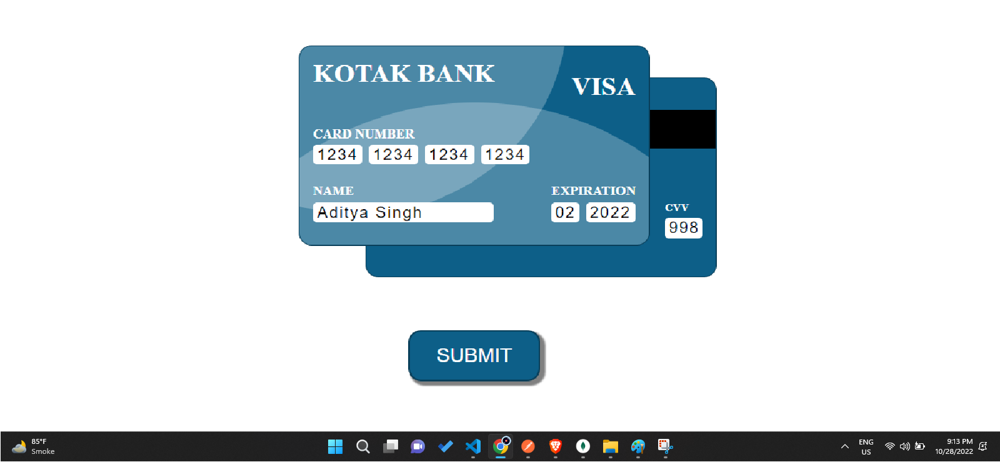
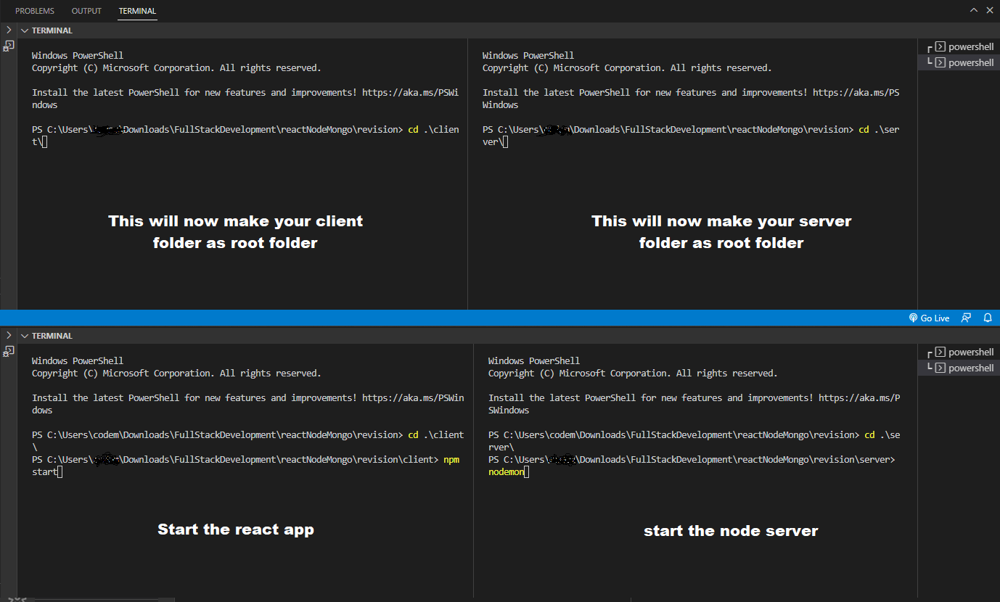
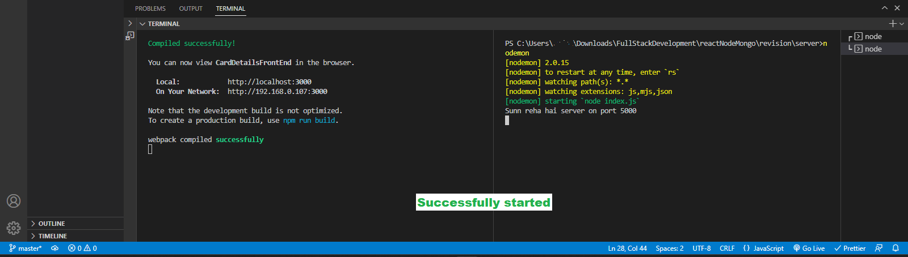
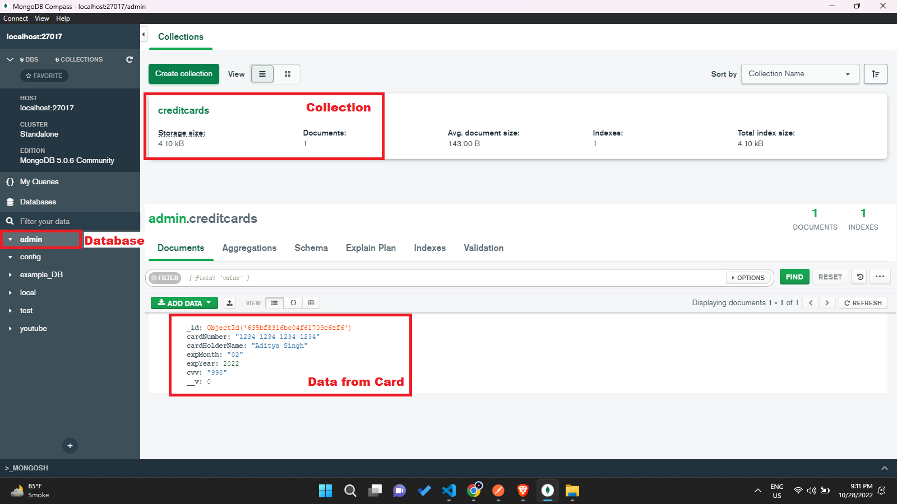

# Creating a MERN Stack Project

To see and modify the files you first have to do some extra work like downloading the prerequisites

[1] VS Code\
[2] Mongo DB

## Now let's start the installation process

In the project directory, you have to start the server and client both :

[1] Type `cd .\client\` \
your folder will change to the client folder\
[2] Type the second command `npm start`\
this will start your frontend server {wait for some time it takes time}

## make a new terminal to start the backend

[1] Type `cd .\server\` \
**your folder will change to the server folder**\
[2] Type the second command `nodemon`\
**this will start your backend server**

# Visual practical for people like me

## Here is how to start the frontEnd and backEnd

[1] Change the root folder to respective sub folder\
[2] Start the server with there respective command

## As you can check it's finally started

[1] Both the server started

## You can find the Uploaded detail in the database

[1] Box in the left show's the dataBase\
[2] Box on the top shows the name of the collection\
[3] The box in the bottom show's the data added

